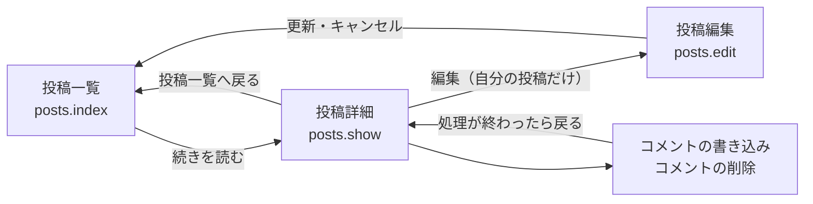
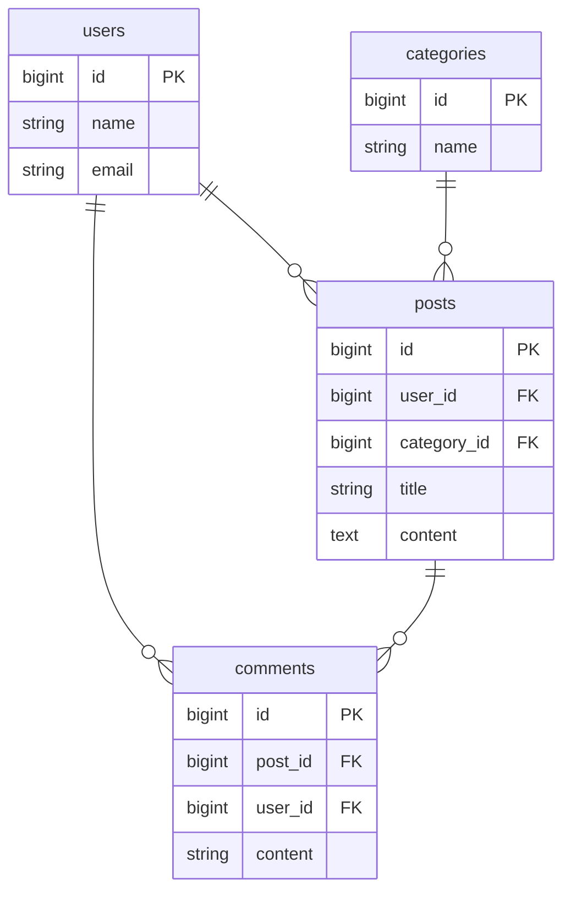
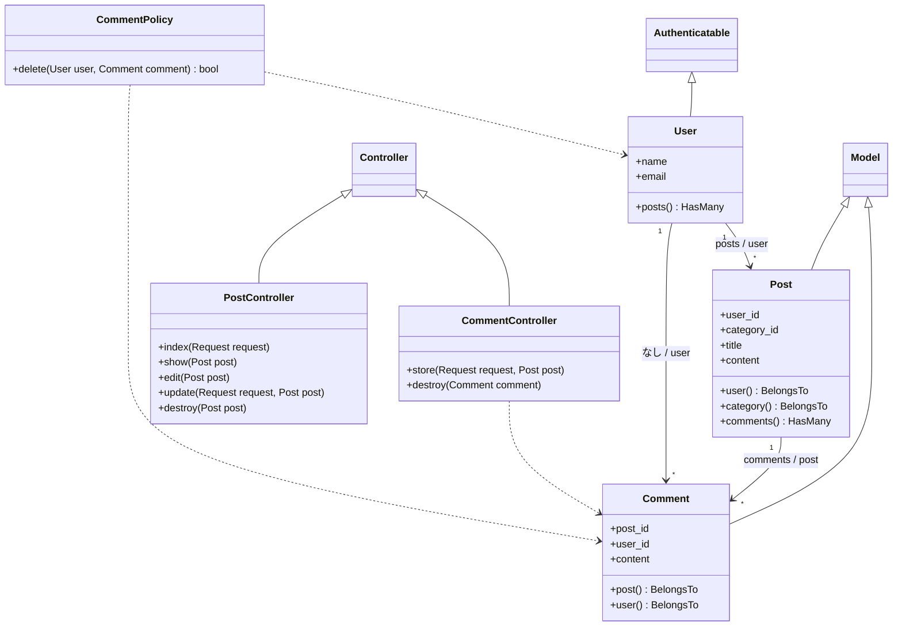
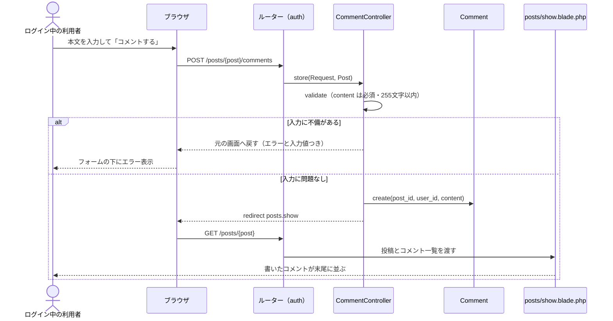
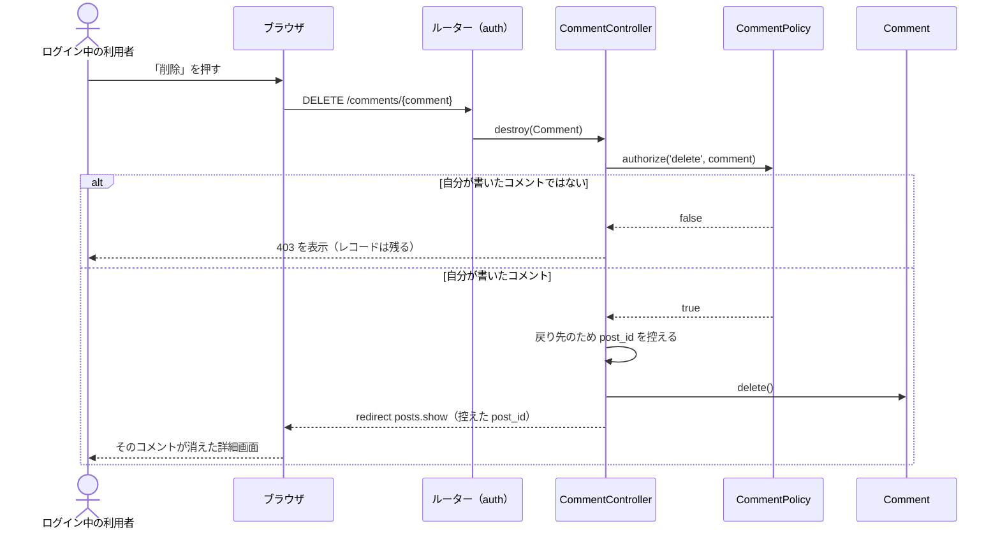

# 投稿詳細画面とコメント機能の設計

Issue [#1](https://github.com/yotaro0616/post-app-practice/issues/1) の設計です。**まだ実装していないもの**を書いています。`docs/structure.md` が「実在するクラスだけ」を書いた図であるのに対して、こちらはこれから作るものの図です。実装が終わったら、ここのクラス図の内容を `docs/structure.md` へ移します。

何を作るか・受け入れ条件・確認事項の一覧は Issue #1 にあります。この設計書は、Issue には書いていない **画面や処理の流れの図** と、**実装するときに迷う箇所をどちらに決めたか** を扱います。

クラス図の記法は `docs/structure.md` に合わせています。`+` `-` は公開／非公開、リレーションの線のラベルは「1側のメソッド名 / 多側のメソッド名」です。

## 画面と導線

「続きを読む」で一覧から詳細へ入り、コメントの書き込みと削除は、どちらも詳細画面へ戻ってきます。



投稿の編集と削除は一覧からも詳細からも行えます。編集後の戻り先は今までどおり一覧です（詳細画面から編集に入っても一覧へ戻ります）。ここを詳細へ戻す変更は今回の範囲に含めません。

## 投稿詳細画面の構成

```
┌──────────────────────────────────────┐
│ ← 投稿一覧へ戻る                      │
│                                      │
│ ユーザーAの投稿1            （h1）    │
│ 投稿者: ユーザーA ／ カテゴリ: お知らせ │
│                                      │
│ 本文をここに全文表示する。            │
│ 一覧のような抜粋ではなく、全部出す。   │
│                                      │
│ [編集] [削除]  ← 自分の投稿のときだけ  │
├──────────────────────────────────────┤
│ コメント                     （h2）   │
│                                      │
│ ユーザーB  2026-08-14 10:00          │
│ なるほど、参考になりました。 [削除]    │
│                          ↑自分のだけ  │
│ ユーザーA  2026-08-14 11:30          │
│ ありがとうございます。                │
├──────────────────────────────────────┤
│ ┌──────────────────────────────────┐ │
│ │（テキストエリア）                 │ │
│ └──────────────────────────────────┘ │
│ [コメントする]                        │
└──────────────────────────────────────┘
```

コメントが 0 件のときは、一覧の位置に「まだコメントはありません。」を出します。

既存の 3 つの Blade（`posts/index` `posts/edit` `auth/*`）はどれも共通レイアウトを使わず、ファイルの中に `<style>` を書く 1 ファイル完結の作りです。`posts/show.blade.php` もこれに合わせます。見た目は `posts/index.blade.php` の `.post-card` の色・角丸・影をそのまま流用します。

## データ設計



新しく作るのは `comments` だけで、既存 3 テーブルは変更しません。

| カラム | 型 | そう決めた理由 |
|:-------|:---|:---------------|
| `post_id` | `foreignId` + `constrained()->cascadeOnDelete()` | 投稿が消えたらコメントも消える。既存の `posts.user_id` と同じ書き方に揃える（**Q-09 未確認**） |
| `user_id` | `foreignId` + `constrained()->cascadeOnDelete()` | 退会したユーザーのコメントを残さない。こちらも既存に揃える |
| `content` | `string`（255 文字） | 本文のカラム名は `body` ではなく `content`。既存の `posts.content` に合わせる。上限 255 文字なので `text` ではなく `string` で足りる |

## クラス設計



- 新しく作るクラス: `Comment` `CommentController` `CommentPolicy`
- 既存クラスへの追加: `Post::comments()` と `PostController::show()`
- `Category` と `PostPolicy` は変更しないため、この図では省いています

`User` から `Comment` への線のラベルを `なし / user` にしているのは、**`User::comments()` を作らない**からです。「あるユーザーが書いたコメントを全部集める」画面は今回ありません。使わないリレーションは足さず、必要になったときに追加します。

## ルート設計

`routes/web.php` の `auth` ミドルウェアグループの中に、既存のルートに続けて 3 本足します。

| メソッド | URI | 名前 | 処理 |
|:---------|:----|:-----|:-----|
| GET | `/posts/{post}` | `posts.show` | `PostController@show` |
| POST | `/posts/{post}/comments` | `comments.store` | `CommentController@store` |
| DELETE | `/comments/{comment}` | `comments.destroy` | `CommentController@destroy` |

- **コメントの削除だけ `/posts/{post}` の下にぶら下げていません。** `comment` の ID が決まれば投稿も決まるので、URL に投稿 ID を持たせる必要がないためです（`/posts/{post}/comments/{comment}` にすると、URL の投稿 ID とコメントの実際の投稿 ID が食い違ったときの処理を別途考えることになります）。
- 書き込み側は逆に、どの投稿へのコメントかを URL で決める必要があるため `/posts/{post}/comments` にします。
- `/posts/{post}` と `/posts/{post}/edit` は URL の区切りの数が違うので、定義する順番は問いません。

## 処理の流れ

### コメントを書き込む



`user_id` と `post_id` はフォームから受け取りません。`user_id` はログイン中のユーザーから、`post_id` は URL の投稿から入れます。フォームの hidden で渡すと、値を書き換えて他人の名前で投稿できてしまうためです。バリデーションの対象は `content` だけです。

### コメントを削除する



他人のコメントには、そもそも画面に削除ボタンが出ません（`@can('delete', $comment)`）。ボタンを隠すだけでは URL を直接叩かれると通ってしまうので、コントローラー側でも `authorize` します。ボタンを隠す＋直接叩くと 403、という形は既存の投稿の編集・削除と同じです。

削除の確認ダイアログは出しません。既存の投稿削除にも無いためです。

## 実装するときの判断

Issue の仕様からは読み取れない「どこにどう書くか」を、ここで決めておきます。

| 論点 | 決めたこと | 理由 |
|:-----|:-----------|:-----|
| コメントの並び順 | `Post::comments()` のリレーション定義に `->oldest()` を付ける | 並び順を書く場所を 1 箇所に閉じる。**Q-08 が未確認**で「新しい順」に変わる可能性があるため、コントローラーやビューに散らさず、ここだけ直せば済む形にしておく |
| 一覧・詳細での読み込み | `PostController@show` で `$post->load(['user', 'category', 'comments.user'])` | ルートモデルバインディングで `Post` は取得済みなので、`with` ではなく `load` で追加読み込みする。`comments.user` まで含めないと、コメントの数だけ `users` を引く N+1 になる |
| 削除後の戻り先 | `delete()` の前に `$postId = $comment->post_id` を控え、それを使って `posts.show` へ戻す | 消したあとのモデルからリレーションを辿る書き方は、読み手が「消えたはずのレコードから辿れるのか」で止まる。`back()` は使わない（戻り先が押した画面まかせになり、テストでも確認しづらい） |
| 一覧の抜粋 | Blade の中で `Str::limit($post->content, 100)` を呼ぶ | 抜粋は表示の都合であってデータの性質ではない。100 という数字は **Q-10 が未確認**なので、変更が Blade 1 ファイルで済む形にしておく。モデルにアクセサは置かない |
| `CommentPolicy` の登録 | `AuthServiceProvider` には何も書かない | `Comment` → `CommentPolicy` は Laravel が名前から自動で見つける。既存の `PostPolicy` も `$policies` が空のまま動いているので、そこに合わせる |
| 投稿を削除したときのコメント | アプリ側では何もせず、DB の `cascadeOnDelete` に任せる | `PostController@destroy` に手を入れずに済む。**Q-09 が未確認** |
| コメント 0 件の判定 | Blade で `$post->comments->isEmpty()` | `posts/index.blade.php` の `$posts->isEmpty()` と同じ書き方に揃える |

## 既存コードへの影響

| ファイル | 区分 | 内容 |
|:---------|:-----|:-----|
| `database/migrations/..._create_comments_table.php` | 新規 | `comments` テーブル |
| `app/Models/Comment.php` | 新規 | `$fillable` と `post()` `user()` |
| `app/Http/Controllers/CommentController.php` | 新規 | `store` `destroy` |
| `app/Policies/CommentPolicy.php` | 新規 | `delete` |
| `resources/views/posts/show.blade.php` | 新規 | 詳細画面 |
| `database/factories/PostFactory.php` | 新規 | テスト用 |
| `database/factories/CommentFactory.php` | 新規 | テスト用 |
| `app/Models/Post.php` | 変更 | `comments()` を追加 |
| `app/Http/Controllers/PostController.php` | 変更 | `show()` を追加 |
| `routes/web.php` | 変更 | ルート 3 本を追加 |
| `resources/views/posts/index.blade.php` | 変更 | 本文を抜粋にし、「続きを読む」を追加 |
| `database/seeders/DatabaseSeeder.php` | 変更 | 練習用のコメントを追加 |
| `README.md` | 変更 | 「できること」に詳細表示とコメントを追記 |
| `docs/structure.md` | 変更 | クラス図に `Comment` `CommentController` `CommentPolicy` を追加 |

`app/Models/User.php` `app/Models/Category.php` `app/Policies/PostPolicy.php` `app/Providers/AuthServiceProvider.php` は変更しません。

## テストの作り

確認する項目そのものは Issue #1 に書いています。ここではその置き場所と、テストデータの作り方を決めます。

現状 `database/factories/` には `UserFactory` しかないため、`PostFactory` と `CommentFactory` を追加します。

- `PostFactory` … `user_id` は `User::factory()` に作らせる。`category_id` は既定値を持たせず、テスト側で `Category::create()` した ID を必ず渡す。カテゴリはシーダーで固定の 3 件を入れる運用なので、`CategoryFactory` は作らない
- `CommentFactory` … `post_id` `user_id` はどちらも既定値を持たせず、使う側から渡す。「自分のコメント」「他人のコメント」を作り分けるのがテストの目的なので、ここを自動生成に任せると誰のコメントか読み取りにくくなる。`content` は短い固定文でよい

テストファイルは 2 本に分けます。

| ファイル | 確認すること |
|:---------|:-------------|
| `tests/Feature/PostShowTest.php` | 詳細画面の表示、未ログイン時のリダイレクト |
| `tests/Feature/CommentTest.php` | コメントの書き込み、バリデーション、自分のコメントの削除、他人のコメント削除で 403 |

「他人のコメントを削除しようとすると 403」は、**403 が返ることだけでなく、レコードが残っていること**（`assertDatabaseHas`）まで見ます。これが今回いちばん壊れやすい要件です。

## 未確定のもの

Issue #1 の確認事項リスト（Q-06〜Q-12）が未確認のままです。このうち設計そのものが変わるのは次の 2 つで、本文中の該当箇所にも印を付けています。

- **Q-08 コメントの並び順**（古い順か新しい順か）… 決まり次第 `Post::comments()` の `->oldest()` を差し替える
- **Q-09 投稿を削除したときにコメントも消すか** … 残す方針になった場合、`comments.post_id` の `cascadeOnDelete` を外し、投稿が消えたあとのコメントの見せ方を別途決める必要がある

なお、この設計書は `docs/14-2/` ではなく `docs/comment.md`（`structure.md` と同じ階層）に置いています。Q-12 のうちドキュメントの置き場所についてはこれで決まりですが、**コミットメッセージに `14-2:` のような番号を付けるかは未確認のまま**です。
