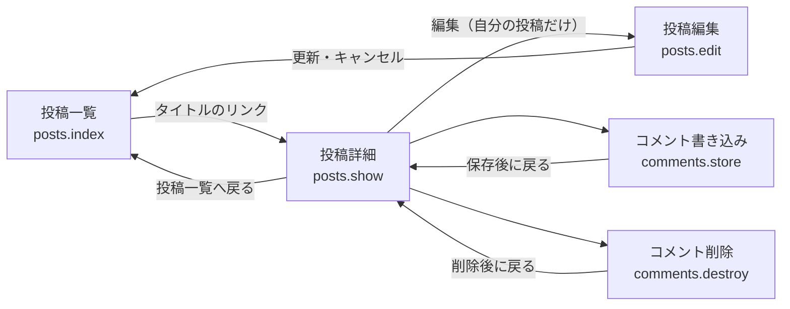
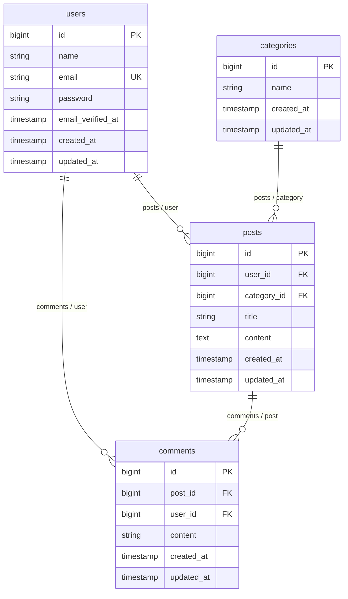

# 投稿詳細画面とコメント機能の設計

Issue [#1](https://github.com/yotaro0616/post-app-practice/issues/1) の設計です。**まだ実装していないもの**を書いています。作業ブランチは `feature/post-comments`（`main` から分岐）です。

Issue #1 が「何を作るか・受け入れ条件・確認事項」を持ち、この文書はそれを実装目線で 7 つの見出しに整理し直したものです。要望文の「リプライ」は、機能としては Issue #1 の「コメント」（ポストへの一言返信、ネストなし）と同じものを指します。実装上の名前は `Comment` / `comments` / `CommentPolicy` を使います。

> `docs/comment.md` は同じ Issue の旧版の設計書です。あちらは一覧を抜粋表示（100 文字＋「…」）に変える前提で書かれていて、今回の「一覧は変えない」方針とは食い違っています。この `docs/reply.md` が現在の方針です。

## 概要

投稿一覧では「誰がどんな投稿をしたか」しか分からず、読んだ人が反応する手段がありません。投稿を 1 件だけ開いて読む画面（`posts.show`）を用意し、その画面から一言返せるようにします。

作るものは 3 つです。

| ID | 機能 | 内容 |
|:---|:-----|:-----|
| F-07 | 投稿の詳細表示 | 投稿 1 件と、その投稿に付いたコメントの一覧を表示する |
| F-08 | コメントの書き込み | 詳細画面のフォームから投稿する。保存後は同じ詳細画面へ戻る |
| F-09 | コメントの削除 | 自分が書いたコメントだけ消せる。判定は `PostPolicy` と同じ形にする |

一覧画面に手を入れるのは、詳細画面へのリンクを 1 つ足すところだけです。

### 画面の行き来



投稿の編集・削除は一覧からも詳細からも行えますが、**編集後の戻り先は今までどおり一覧です**。詳細画面から編集に入っても一覧へ戻ります。ここを詳細へ戻す変更は今回の範囲に含めません（既存の `PostController@update` / `destroy` を触らないため）。

### 追加・変更するファイル

| 種別 | ファイル | 内容 |
|:-----|:---------|:-----|
| 追加 | `database/migrations/xxxx_create_comments_table.php` | `comments` テーブル |
| 追加 | `app/Models/Comment.php` | `$fillable` は `post_id` / `user_id` / `content`、`post()` `user()` の `BelongsTo` |
| 追加 | `app/Policies/CommentPolicy.php` | `delete()` のみ |
| 追加 | `app/Http/Controllers/CommentController.php` | `store()` / `destroy()` |
| 追加 | `resources/views/posts/show.blade.php` | 投稿詳細画面 |
| 追加 | `database/factories/PostFactory.php` `CommentFactory.php` | テスト用（現在は `UserFactory` のみ） |
| 変更 | `app/Models/Post.php` | `comments()`（`HasMany`）を足すだけ |
| 変更 | `app/Http/Controllers/PostController.php` | `show()` を足すだけ。既存メソッドは触らない |
| 変更 | `routes/web.php` | ルート 3 本を `auth` グループへ追加 |
| 変更 | `resources/views/posts/index.blade.php` | 詳細画面へのリンクを 1 つ足すだけ |
| 変更 | `database/seeders/DatabaseSeeder.php` | 練習用コメントを追加 |

### 追加するルート

`routes/web.php` の `auth` ミドルウェアグループへ入れます。`show` は既存の並びを崩さないよう `index` の直後に置きます。

| メソッド | URI | 名前 | 処理 |
|:---------|:----|:-----|:-----|
| GET | `/posts/{post}` | `posts.show` | `PostController@show` |
| POST | `/posts/{post}/comments` | `comments.store` | `CommentController@store` |
| DELETE | `/comments/{comment}` | `comments.destroy` | `CommentController@destroy` |

### 権限の考え方

`app/Policies/PostPolicy.php` のやり方に揃えます。

```
PostPolicy::delete(User $user, Post $post): bool
    → $user->id === $post->user_id

CommentPolicy::delete(User $user, Comment $comment): bool
    → $user->id === $comment->user_id   ← 同じ形
```

- コントローラ側は `$this->authorize('delete', $comment)` で確認してから削除する（既存の `PostController@destroy` と同じ）
- 画面側は `@can('delete', $comment)` で削除ボタンを出し分ける（既存の一覧と同じ）
- Laravel の自動検出で `Comment` ↔ `CommentPolicy` が紐づくため、`AuthServiceProvider::$policies` への登録は不要（`PostPolicy` も登録していない）
- コメントの編集は作らないので、`CommentPolicy` に `update()` は置かない
- 投稿の書き手であっても、自分の投稿に付いた**他人のコメントは削除できない**（Issue #1 の Q-06。未確認）

## 受け入れ条件

Issue #1 の受け入れ条件をそのまま持ってきています。

- [ ] 一覧画面のリンクから `/posts/{id}` を開くと、そのポストとコメントの一覧が見える
- [ ] 詳細画面のフォームに本文を入れてコメントを送ると、同じ画面のコメント一覧に古い順で増える
- [ ] 本文が空のまま送るとエラーメッセージが表示され、コメントは増えない（256 文字以上も同様）
- [ ] 自分が書いたコメントには削除ボタンが出て、押すと削除できる
- [ ] 他人が書いたコメントには削除ボタンが出ない
- [ ] 他人のコメントの削除 URL を直接叩くと 403 になる
- [ ] 未ログインで `/posts/{id}` を開くとログイン画面へリダイレクトされる
- [ ] 投稿を削除すると、その投稿に付いていたコメントも消える
- [ ] 一覧画面の表示（本文の全文表示）・カテゴリ絞り込み・件数表示が今までどおり動く
- [ ] 投稿の編集・削除が今までどおり動く（`tests/Feature/PostUpdateTest.php` が通る）

## 変えないもの

### タイムラインの挙動（一覧・編集・削除）

| 対象 | 今の状態 | 今回 |
|:-----|:---------|:-----|
| 一覧の本文表示 | 全文表示 | **変えない**（抜粋にしない） |
| 一覧のカテゴリ絞り込み | `?category_id=` で絞り込み | 変えない |
| 一覧の件数表示 | 件数を表示 | 変えない |
| 一覧の並び順 | `latest()`（新しい順） | 変えない |
| 一覧の編集／削除ボタン | `@can` で出し分け | 変えない |
| 投稿の編集（`posts.edit` / `posts.update`） | 更新後は一覧へ戻る | 変えない |
| 投稿の削除（`posts.destroy`） | 削除後は一覧へ戻る。確認ダイアログなし | 変えない |
| `PostController@index` / `edit` / `update` / `destroy` | — | コードを触らない |

一覧画面（`index.blade.php`）に加えるのは詳細画面へのリンク 1 つだけです。

### 今回作らないもの

| 作らないもの | 理由 |
|:-------------|:-----|
| 一覧の抜粋表示（100 文字＋「…」） | 「一覧の今の動きは変えない」ため。旧版の設計から取りやめ |
| 一覧への「コメント◯件」表示 | 同上。一覧は導線のリンク追加だけにとどめる |
| コメントの編集 | 要望は「書き込み」と「削除」のみ。間違えたら消して書き直す運用とする |
| コメントへの返信（ネスト構造） | 「一言返せる」までが今回の範囲 |
| コメントの通知・メール送信 | 今回の範囲外 |
| いいね・リアクション | 今回の範囲外 |
| コメントのページネーション | 練習用データ量では不要 |
| 未ログインでの閲覧 | 既存のルートがすべて `auth` 配下のため、詳細画面も合わせる |
| 共通レイアウトの新設 | 既存の Blade は 1 ファイル完結で `<style>` を各ファイルに書く作り。`show.blade.php` もこれに合わせる |

## 増えるテーブル

増えるのは `comments` の 1 つだけです。既存の `users` / `posts` / `categories` は変更しません。



### `comments`

| カラム | 型 | 制約 | 内容 |
|:-------|:---|:-----|:-----|
| `id` | bigint unsigned | PK, AI | |
| `post_id` | bigint unsigned | FK → `posts.id`, `cascadeOnDelete` | どの投稿へのコメントか |
| `user_id` | bigint unsigned | FK → `users.id`, `cascadeOnDelete` | 誰が書いたか |
| `content` | string(255) | NOT NULL | コメント本文 |
| `created_at` | timestamp | | 並び順にも使う |
| `updated_at` | timestamp | | |

決めたことと理由:

- **本文のカラム名は `body` ではなく `content`**。既存の `posts.content` に合わせるため
- **`content` は `string`（varchar 255）**。`posts.content` は `text` だが、コメントは一言想定なので上限を型で持たせる。入力チェックの `max:255` と同じ値
- **`cascadeOnDelete`** により、投稿が消えるとその投稿のコメントも消える。ユーザーが消えた場合も同じ（既存の `posts.user_id` と同じ書き方に揃える）
- 外部キーは `constrained()->cascadeOnDelete()` で書く

### モデルのリレーション

| クラス | メソッド | 種別 | 相手 |
|:-------|:---------|:-----|:-----|
| `Post` | `comments()` | `HasMany` | `Comment` |
| `Comment` | `post()` | `BelongsTo` | `Post` |
| `Comment` | `user()` | `BelongsTo` | `User` |

`User` 側に `comments()` は今回作りません（画面から必要にならないため）。

## 増える画面

### 投稿詳細画面（新規: `resources/views/posts/show.blade.php`）

```
┌──────────────────────────────────────┐
│ ← 投稿一覧へ戻る                      │
│                                      │
│ ユーザーAの投稿1            （h1）    │
│ 投稿者: ユーザーA ／ カテゴリ: お知らせ │
│                                      │
│ 本文をここに全文表示する。            │
│                                      │
│ [編集] [削除]  ← 自分の投稿のときだけ  │
├──────────────────────────────────────┤
│ コメント                     （h2）   │
│                                      │
│ ユーザーB  2026-08-14 10:00          │
│ なるほど、参考になりました。 [削除]    │
│                          ↑自分のだけ  │
│ ユーザーA  2026-08-14 11:30          │
│ ありがとうございます。                │
├──────────────────────────────────────┤
│ ┌──────────────────────────────────┐ │
│ │（テキストエリア）                 │ │
│ └──────────────────────────────────┘ │
│ [コメントする]                        │
└──────────────────────────────────────┘
```

- 投稿部分: タイトル・投稿者名・カテゴリ・本文（全文）
- 自分の投稿なら「編集」「削除」ボタンを出す（`@can('update', $post)` / `@can('delete', $post)`）
- 「投稿一覧へ戻る」リンクを置く
- コメント一覧: コメントした人の名前・投稿日時・本文
  - 並び順は**古い順**（`created_at` の昇順）
  - 0 件のときは「まだコメントはありません。」を表示する
  - 自分が書いたコメントにだけ「削除」ボタンを出す（`@can('delete', $comment)`）
  - 削除の確認ダイアログは出さない（既存の投稿削除に合わせる）
- コメント入力フォーム: テキストエリア＋「コメントする」ボタン
  - エラー時はテキストエリアの下にメッセージを出し、入力値は `old('content')` で残す
  - **テキストエリアに HTML の `required` 属性は付けない**。付けるとブラウザ側で送信が止まり、「本文が空だとサーバー側のエラーが表示される」という受け入れ条件をブラウザで確認できなくなるため（既存の `edit.blade.php` は `required` を付けているが、ここは意図的に外す）
- エラー表示の見た目は既存の `edit.blade.php` に合わせる（`.error { color: #dc2626; font-size: 0.875rem; }`）

データの読み込みは `PostController@show` で `$post->load(['user', 'category', 'comments.user'])` を行い、コメントごとの N+1 を出さないようにします。

### 投稿一覧画面（変更: `resources/views/posts/index.blade.php`）

- 各投稿のタイトルを `posts.show` へのリンクにする（Issue #1 の Q-11。未確認）
- **それ以外は一切変更しない**。本文は今までどおり全文表示、カテゴリ絞り込み・件数表示・編集／削除ボタンもそのまま

## 入力チェックとメッセージ一覧

チェックするのはコメント本文だけです。`CommentController@store` で `$request->validate()` を使います。

```
'content' => 'required|string|max:255'
```

`post_id` はURL の `{post}`、`user_id` は `auth()->id()` から入れます。**どちらもフォームからは受け取りません**（他人になりすましてコメントできないようにするため）。

### メッセージ

`config/app.php` の `locale` は `en` で、`lang/` ディレクトリも置いていないため、メッセージは Laravel の英語の既定文言がそのまま出ます。

| 場面 | ルール | 表示されるメッセージ |
|:-----|:-------|:---------------------|
| 本文が空のまま送信 | `required` | `The content field is required.` |
| 本文が 256 文字以上 | `max:255` | `The content field must not be greater than 255 characters.` |

- 表示位置はテキストエリアの下（`@error('content')`）
- 入力値は `old('content')` で残す
- 日本語化はこの Issue の範囲に含めません（既存の投稿編集画面も英語の既定文言のままで、そこだけ日本語にすると画面ごとにちぐはぐになるため）

### 権限まわりの応答

入力チェックではありませんが、あわせて整理します。

| 場面 | 応答 |
|:-----|:-----|
| 他人のコメントの削除 URL を直接叩く | 403（`authorize('delete', $comment)` が落ちる） |
| 未ログインで詳細画面・コメント操作 | ログイン画面へリダイレクト（`auth` ミドルウェア） |
| 存在しない投稿 ID を開く | 404（ルートモデルバインディング） |

## テスト観点

`tests/Feature/` に追加します。`RefreshDatabase` を使い、`PostFactory` / `CommentFactory` を新設して組み立てます。

### 詳細表示（F-07）

| # | 観点 | 期待 |
|:--|:-----|:-----|
| 1 | ログイン済みで `/posts/{id}` を開く | 200。投稿のタイトル・本文（全文）・投稿者名・カテゴリが出る |
| 2 | コメントが付いた投稿を開く | 各コメントの本文と書いた人の名前が出る |
| 3 | コメントの並び順 | 古い順に並ぶ（先に作ったコメントが先に出る） |
| 4 | コメント 0 件の投稿を開く | 「まだコメントはありません。」が出る |
| 5 | 未ログインで開く | ログイン画面へリダイレクト |

### 書き込み（F-08）

| # | 観点 | 期待 |
|:--|:-----|:-----|
| 6 | 本文を入れて送信 | `comments` に 1 件保存され、詳細画面へリダイレクト。`post_id` と `user_id` がログイン中のユーザー／その投稿になっている |
| 7 | 本文が空で送信 | `content` にバリデーションエラー。`comments` は増えない |
| 8 | 本文が 256 文字で送信 | 同上（255 文字は通ることも合わせて確認する） |
| 9 | 未ログインで送信 | ログイン画面へリダイレクトされ、保存されない |

### 削除（F-09）

| # | 観点 | 期待 |
|:--|:-----|:-----|
| 10 | 自分のコメントを削除 | レコードが消え、詳細画面へリダイレクト |
| 11 | 他人のコメントの削除 URL を叩く | 403。レコードは残る |
| 12 | 投稿の書き手が、自分の投稿に付いた他人のコメントを削除 | 403。レコードは残る（Q-06 の想定を固定する） |
| 13 | 詳細画面の削除ボタンの出し分け | 自分のコメントにだけ出て、他人のコメントには出ない |

### 連動・デグレ確認

| # | 観点 | 期待 |
|:--|:-----|:-----|
| 14 | コメントの付いた投稿を削除 | そのコメントも消える（`cascadeOnDelete`） |
| 15 | 既存の `tests/Feature/PostUpdateTest.php` | そのまま通る |
| 16 | 一覧のカテゴリ絞り込みと件数表示 | 今までどおり動く |

## 未確認の事項

Issue #1 の確認事項リスト（Q-06〜Q-13）が未回答です。この設計書はすべて「こちらの想定」で書いています。回答次第で変わるのは次の箇所です。

| ID | 内容 | 変わる箇所 |
|:---|:-----|:-----------|
| Q-06 | 投稿の書き手も他人のコメントは消せない | 「増える画面」「テスト観点 #12」 |
| Q-07 | 詳細画面もログイン必須 | 「変えないもの」「テスト観点 #5」 |
| Q-08 | コメントは古い順 | 「増える画面」「テスト観点 #3」 |
| Q-09 | 投稿を消すとコメントも消える | 「増えるテーブル」「テスト観点 #14」 |
| Q-10 | 本文の上限は 255 文字 | 「増えるテーブル」「入力チェックとメッセージ一覧」 |
| Q-11 | 一覧の導線はタイトルのリンク | 「増える画面」 |
| Q-12 | ドキュメントとコミットの番号は `14-2` | この文書の置き場所 |
| Q-13 | 実装名は `Comment`、画面表示も「コメント」 | 全体 |
